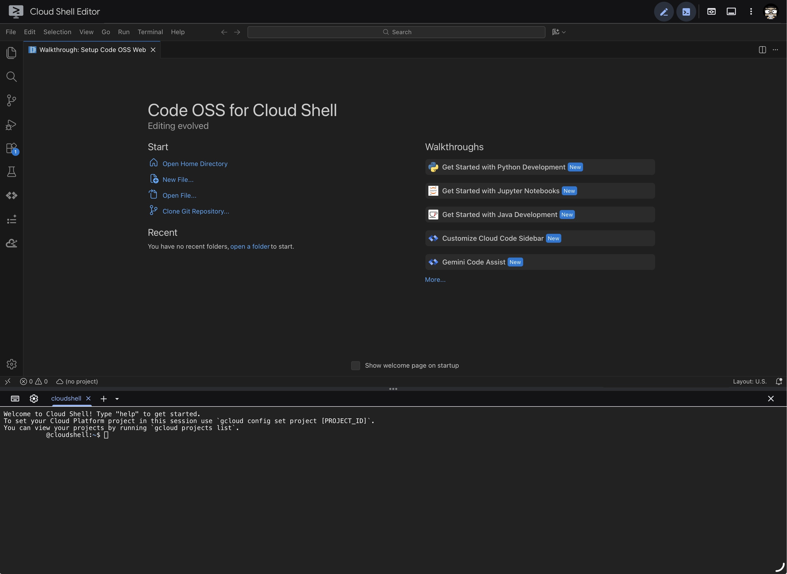
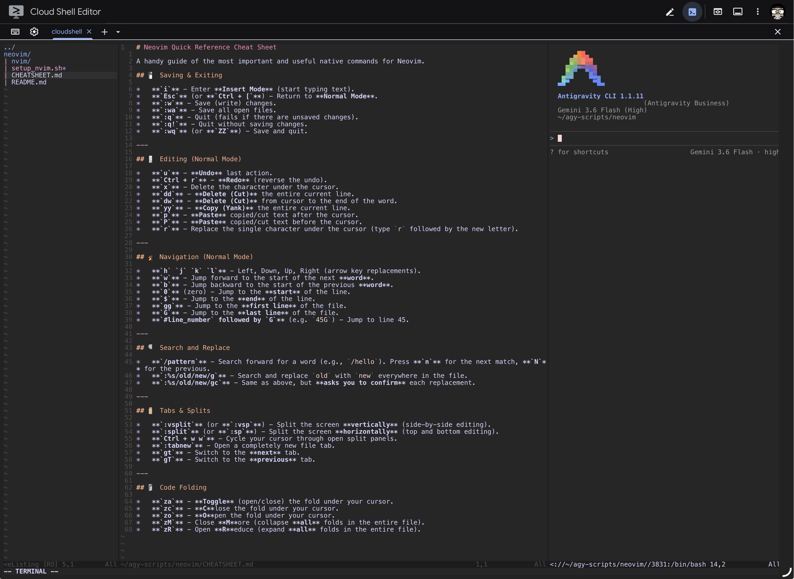

A GUI IDE is great for local development, but it quickly falls apart when you transition to headless servers, low-power client machines, or remote clouds. 

If you pair an AI agent like **Antigravity CLI** with a native-first Neovim configuration, you can bypass complex setups entirely. Since the AI assistant is the one doing the heavy writing, refactoring, and saving of files, you don't need to be a Vim keyboard wizard to use Neovim. The editor simply becomes a fast, native terminal pane for inspecting the code and reviewing git diffs.

By pairing the two, you can build a modern, high-performance workspace built on native features that runs perfectly in any terminal.

Here is the backstory of how we ended up with this setup, and why going native-first in Neovim became our preferred remote development tool.


---

## 💻 The Backstory: From a Broken Screen to Ephemeral Cloud VMs

My 10-year-old MacBook Pro recently had its screen break. It still works fine, but it is now permanently anchored to my desk with an external monitor. Buying a new laptop is too expensive right now, but I have an iPad that I use when traveling.

To work from the iPad, I use Google Cloud Shell via the web browser. This allows me to write and inspect code using the Cloud Shell Editor and run **Antigravity CLI**.



However, Cloud Shell has strict storage, memory, and CPU limits. As an Application Modernization, DevOps, and SRE developer, my projects are resource-intensive. I need to run multi-container environments like the Google Cloud [Microservices Demo](https://github.com/googlecloudplatform/microservices-demo). Plus, next week I’m attending the **Gemma Day Event** hosted by the Google DeepMind team. This will be my first hands-on contact with Gemma, and after the event, I plan to continue testing how the model interacts inside a Kubernetes cluster, establishing observability for **LLM-native metrics** (like token throughput and response latency). I don't want to buy an expensive machine with a GPU just to test these setups. Instead, I want to spin up a GPU-enabled VM in Compute Engine, run my tests, and delete it to control costs.

This left us with a new problem: **How do we easily edit and inspect code on these remote, ephemeral VMs?**

While Cloud Shell Editor works great for local files, connecting it to a remote VM via SSH requires a third-party extension. To keep our workflow simple and work directly inside the active SSH terminal session, we needed a lightweight, responsive editor that we could quickly set up on that remote machine, without a complex configuration process or consuming unnecessary VM resources.


---

## 🛠️ The Architecture: Built-In Simplicity

The core design of this setup is to use Neovim’s native options and features to shape the editor workspace, keeping it simple and portable.

1. **Leveraging Built-In Options**: We use Neovim's built-in configuration settings (like `relativenumber` for fast jumps, `smartindent` for auto-formatting, and `autoread`) to establish a modern development environment directly.
2. **Native Auto-Commands (`autocmd`)**: We use Neovim's built-in auto-command system to manage interactive workspace behaviors—such as maintaining window widths, entering insert mode in terminals on focus, and triggering file reloads.
3. **Minimal Dependencies**: While we rely primarily on built-in features, we add just two external packages to make the workspace visually comfortable: Catppuccin Mocha for theme styling, and Vim-Terraform for syntax highlighting.
4. **Single Configuration File**: Every option, keymap, and auto-command lives in a single `init.lua` file. This keeps the configuration highly portable and easy to provision on any machine in seconds.

This native-first structure delivers a highly responsive, clean terminal editor that is easy to understand and maintain.

---

## 🌟 Built-In Features: Customizing the IDE Experience

To create a modern workspace, we can customize Neovim's native settings directly inside `init.lua` to replicate common IDE behaviors.

### Why the 3-Column Layout?

When developing in a terminal-only environment, managing multiple SSH windows or constantly toggling splits gets messy. To solve this, we configured an automatic layout system that splits your terminal into three stable columns:

1. **Left Panel (15% width)**: The custom Netrw tree sidebar for directory browsing.
2. **Center Panel (55% width)**: Your active editing buffer, where Netrw is configured to automatically open files.
3. **Right Panel (30% width)**: An active terminal split window, perfect for running deployment scripts, monitoring logs, or chatting with **Antigravity CLI** to edit and debug code.

This three-panel layout allows you to write code, navigate files, and interact with the terminal in a single SSH session without overlapping windows.



---

### 1. The Modern Sidebar: Customizing `Netrw`

Neovim includes a built-in file explorer called `netrw`. With a few native options and an auto-command, we can format it into a clean, modern tree-style sidebar:

```lua
vim.g.netrw_banner = 0            -- Hide the help banner
vim.g.netrw_liststyle = 3         -- Tree-style view
vim.g.netrw_winsize = 25          -- Narrow tree view (25% width)
vim.g.netrw_browse_split = 0      -- Open files in the target window
```

We also added a layout helper that automatically sets up and maintains split widths when opening a folder: **Netrw on the left (15%), Editor in the middle, and terminal on the far right (30%)**:

```lua
-- Toggle file tree with Space + e
vim.keymap.set('n', '<leader>e', function()
  vim.cmd('Lexplore')
  adjust_layout() -- Custom layout resizing function
end, { silent = true })
```

### 2. Fast File Previewing (The Capital "P" Key)

Many graphical IDEs allow you to preview a file without losing keyboard focus in the file explorer. We can replicate this behavior inside Netrw with a simple keymap bound specifically to file explorer buffers, using **capital P** (Shift + p):

```lua
vim.api.nvim_create_autocmd('FileType', {
  pattern = 'netrw',
  callback = function()
    -- Map 'P' to open the file (<CR>) and immediately jump back to the tree window (<C-w>h)
    vim.keymap.set('n', 'P', '<CR><C-w>h', { buffer = true, remap = true, silent = true })
  end,
})
```
Now, you can scroll through your project directory, press **`P` (capital P)** to preview any file in the editor pane, and immediately keep using `j`/`k` to scan the next files.

### 3. Built-In Autocomplete

For fast, lightweight text completion based on the words in your active files, Neovim has a built-in completion system. We can configure this to pop up automatically as you type, and map it to `Tab` / `Shift+Tab` for smooth navigation:

```lua
-- Auto-trigger autocomplete as you type letters
vim.api.nvim_create_autocmd('InsertCharPre', {
  pattern = '*',
  callback = function()
    if vim.fn.pumvisible() == 0 and vim.v.char:match('%a') then
      vim.schedule(function()
        vim.fn.feedkeys(vim.api.nvim_replace_termcodes('<C-n>', true, false, true), 'n')
      end)
    end
  end,
})

-- Use Tab to navigate the popup list
vim.keymap.set('i', '<Tab>', function()
  return vim.fn.pumvisible() == 1 and '<C-n>' or '<Tab>'
end, { expr = true })
```

### 4. Seamless Terminal Integration

We mapped standard navigation keys so you can move between splits seamlessly, even while inside an active terminal session:

```lua
-- Exit terminal mode easily
vim.keymap.set('t', '<Esc>', [[<C-\><C-n>]])

-- Jump windows directly from terminal insert mode
vim.keymap.set('t', '<C-h>', [[<C-\><C-n><C-w>h]])
vim.keymap.set('t', '<C-l>', [[<C-\><C-n><C-w>l]])

-- Auto-enter insert mode when focusing the terminal
vim.api.nvim_create_autocmd({ 'BufWinEnter', 'WinEnter' }, {
  pattern = 'term://*',
  callback = function()
    vim.cmd('startinsert')
  end,
})
```

### 5. Real-Time File Auto-Reloading (`autoread`)

When pair-programming with AI coding assistants (like Antigravity CLI) or running automated scripts, files are constantly modified on disk. By default, Neovim does not automatically refresh open files unless you restart or reload manually. 

We enabled native `autoread` and set up an autocmd to automatically trigger a reload (`checktime`) whenever focus returns to a window or a cursor moves:

```lua
vim.opt.autoread = true           -- Automatically reload files changed outside Neovim

-- Automatically trigger checktime to reload files when they change on disk
vim.api.nvim_create_autocmd({ "BufEnter", "CursorHold", "CursorHoldI", "FocusGained" }, {
  command = "if mode() != 'c' | checktime | endif",
  pattern = { "*" },
})
```

### 6. Git Diff Visualizer

We can leverage Neovim's integrated terminal to review git modifications directly. We mapped `<leader>gd` (Space + g + d) to open a new tab containing a terminal running `git diff`:

```lua
vim.keymap.set('n', '<leader>gd', ':tabedit | term git diff<CR>', { silent = true })
```
When you are done reviewing the diff, simply typing `exit` to close the terminal tab brings you right back to your editing session.

---

## 🚀 Automating the Setup: Any Machine, One Command

To make this workspace truly portable, we wrote a shell installer `setup_nvim.sh`. The script detects the OS (macOS Intel/Apple Silicon, or Linux x86_64), downloads the official, pre-compiled Neovim v0.10.4 release, and sets up `init.lua`. The only prerequisite is having `git` installed, which the script uses to clone the Catppuccin and Terraform packages natively.

### The One-Liner
If you are on a remote VM, you can spin up this workspace instantly without even cloning the repository:

```bash
bash <(curl -sSL https://raw.githubusercontent.com/AlvarDev/agy-scripts/main/neovim/setup_nvim.sh)
```
*(Select Option `1` to install).*

---

## 🤝 Try it, tweak it, and share your thoughts

This is the first configuration I’ve shared publicly. It might not be perfect for every style of development, but my hope is that someone finds it helpful. 

Because it is a native-first setup, it is simple, lightweight, and highly adaptable. It serves as a clean, portable foundation that you can easily make your own.

I invite you to run the setup script, modify the configurations, and customize it to fit your needs. If you have your own favorite native Neovim tricks or recommendations, I would love to hear them in the comments!

— AlvarDev


